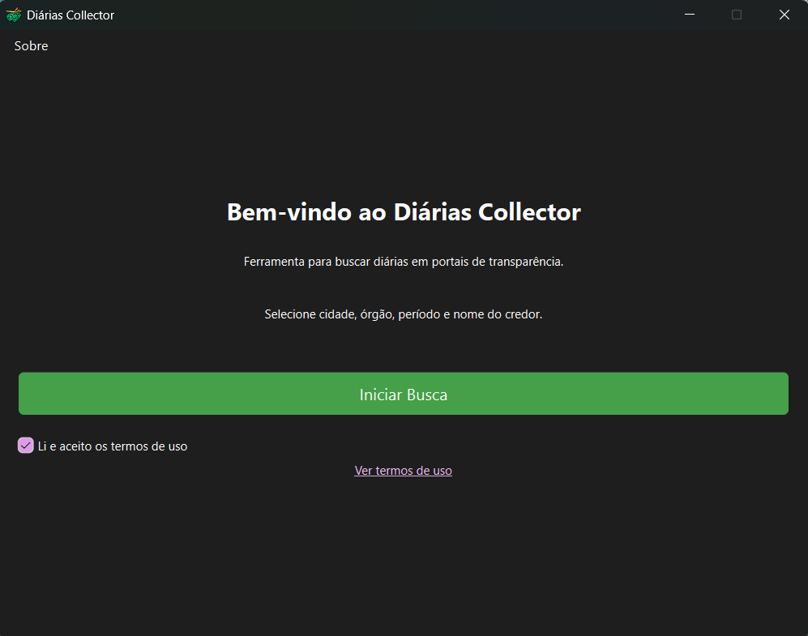
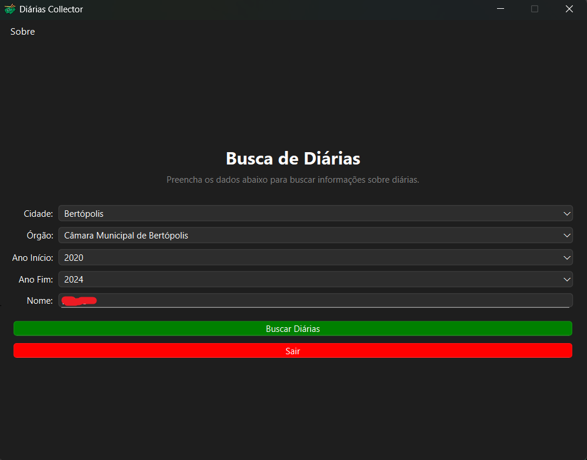
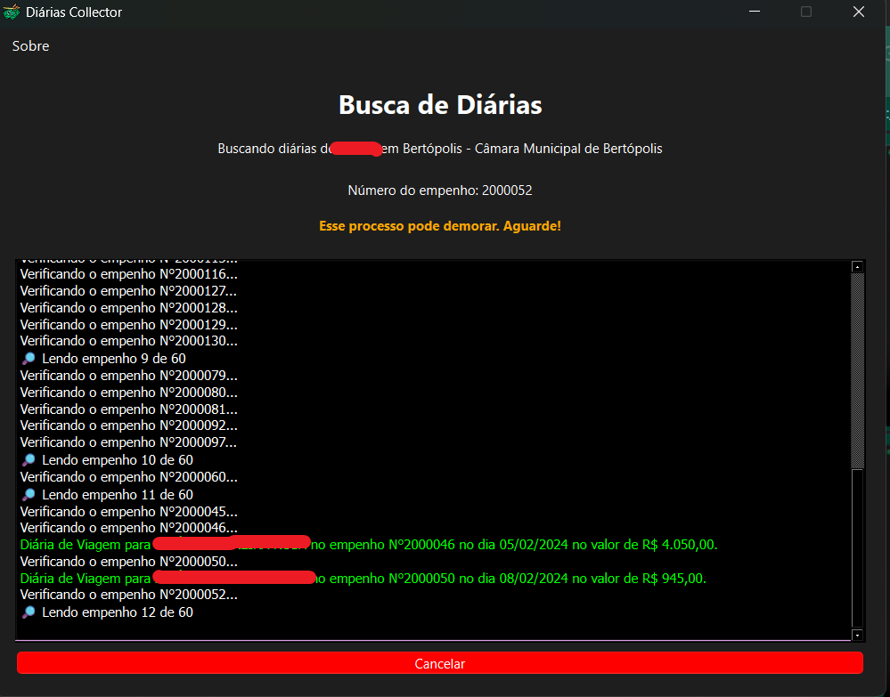
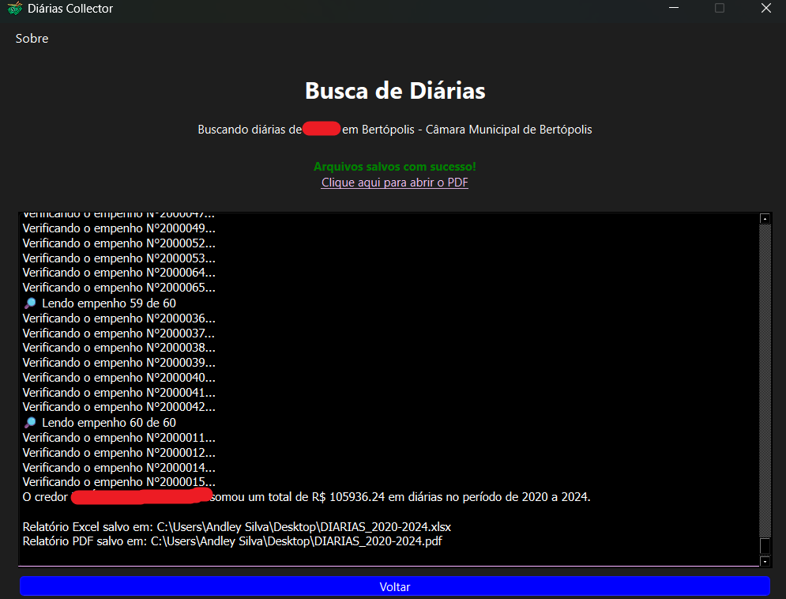
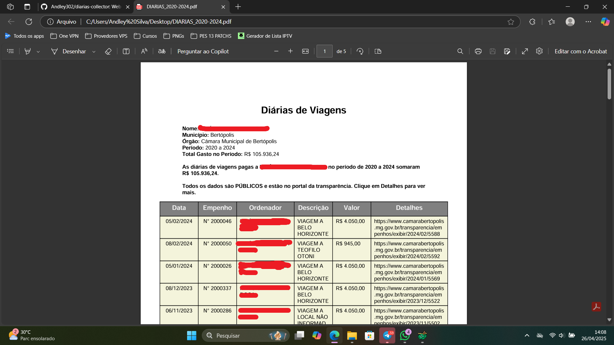
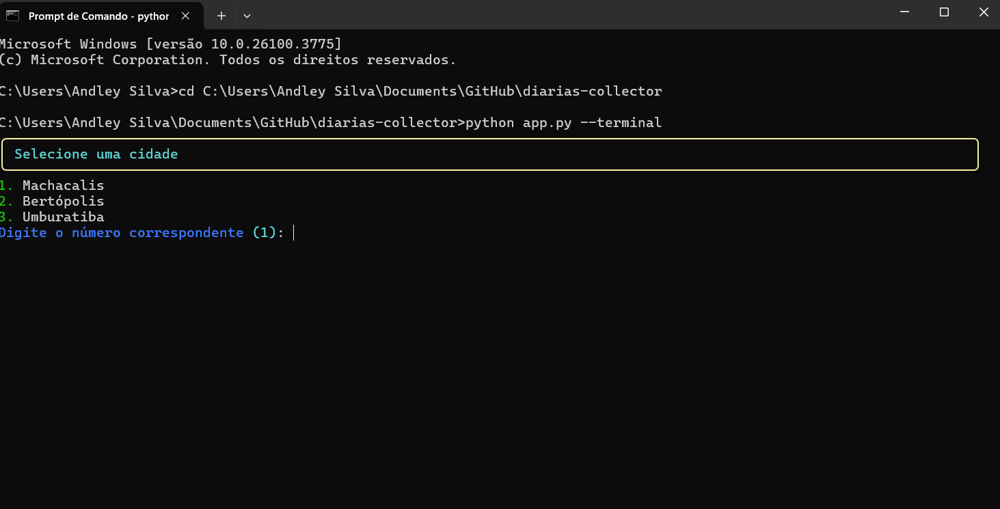

# Diárias Collector 🔍

<p align="center">
  
</p>

Um web scraper especializado para organizar informações sobre subsídios de viagem públicas de pessoas nos portais de transparência.

## Sobre o Projeto

Este sistema é um web scraper especializado que organiza informações já públicas de diárias de viagem disponíveis nos portais de transparência. Embora esses dados sejam públicos, as plataformas oficiais nem sempre oferecem ferramentas adequadas para filtrar e organizar as informações por servidor/beneficiário.

### Objetivo
- Facilitar a visualização de diárias por pessoa específica
- Consolidar dados dispersos em relatórios organizados
- Automatizar a coleta de informações públicas

## 🖼️ Capturas de Tela

### Tela Inicial
<p align="center">
  
</p>

### Progresso de uma Busca
<p align="center">
  
</p>

### Resultado de uma Busca
<p align="center">
  
</p>

### Arquivo PDF Gerado
<p align="center">
  
</p>

### Download e Execução
## 🖥️ Execução via Interface Gráfica

### 🪟 Windows

Você pode escolher entre baixar o **instalador** ou o **arquivo .zip**:

#### 📦 Instalador (recomendado)
1. Acesse a aba **[Releases](https://github.com/Andley302/diarias-collector/releases)** do repositório.
2. Baixe o arquivo **`DiariasCollector_Windows_Setup_x86_64.exe`** para Windows x64.
3. Execute o instalador e siga as instruções na tela.
4. Após a instalação, abra o **Diárias Collector** pelo Menu Iniciar ou pela Área de Trabalho.

> Durante a instalação, será necessário aceitar os Termos de Uso.

---

#### 🗜️ Arquivo .zip (alternativo)
1. Acesse a aba **[Releases](https://github.com/Andley302/diarias-collector/releases)**.
2. Baixe o arquivo **`DiariasCollector_Windows_x86_64.zip`**.
3. Extraia o conteúdo do `.zip`.
4. Abra a pasta extraída e dê **dois cliques** em `DiariasCollector.exe` para iniciar o programa.

> Atenção: usando a versão `.zip`, você será responsável por manter os arquivos organizados manualmente.

### 🐧 Linux
1. Acesse a aba **[Releases](https://github.com/Andley302/diarias-collector/releases)** do repositório.
2. Baixe o arquivo para `DiariasCollector_Linux_x86_64.zip`.
3. Extraia o conteúdo do `.zip`.
4. Abra a pasta extraída, procure o executável e clique com o botão direito no arquivo `DiariasCollector`, vá em **Propriedades > Permissões** e marque **"Permitir execução como programa"** (se necessário).
5. Dê **dois cliques** no arquivo para executá-lo.

## 💻 Execução via Terminal

* Seguia os passos de compilação (clonar repositório, instalar dependências etc)

### 🪟 Windows
```bash
cd DiariasCollector
python app.py --terminal
```

### 🐧 Linux
```bash
cd DiariasCollector
python3 app.py --terminal
```

### Visualização do Terminal


**Observações:**
- No Windows: Execute diretamente após entrar na pasta extraída
- No Linux: Necessário dar permissão de execução apenas na primeira vez
- O terminal deve estar no diretório onde o arquivo foi extraído

### Considerações Importantes

#### Dados e Precisão
- Todas as informações coletadas são públicas e disponíveis nos portais oficiais
- Os relatórios gerados são compilações automatizadas, podendo conter imprecisões
- Não nos responsabilizamos pela precisão dos dados, que refletem o conteúdo dos portais
- Recomendamos sempre verificar as informações nas fontes oficiais

#### Limitações Técnicas
- O funcionamento depende da estrutura HTML dos portais
- Alterações nos sites podem afetar temporariamente a coleta
- Alguns portais podem implementar limites de requisições
- Possíveis bloqueios temporários de IP por excesso de acessos
- Mudanças nas URLs ou layouts podem requerer atualizações

#### Boas Práticas
- Use intervalos razoáveis entre consultas
- Evite múltiplas requisições simultâneas
- Mantenha o software atualizado
- Verifique a disponibilidade do portal antes das consultas

## Cidades e Portais Suportados

Os sistema atualmente suporta os municípios e órgãos que usam o Portal da Transparência da Digitaliza (https://www.digitaliza.com.br). Veja a lista abaixo:

### Machacalis
- Prefeitura Municipal de Machacalis

### Bertópolis
- Prefeitura Municipal de Bertópolis
- Câmara Municipal de Bertópolis

### Umburatiba
- Prefeitura Municipal de Umburatiba

## Arquivos de Configuração
Em `resources/`, você encontrará arquivos de configuração:
### cidades.json
Mapeia as cidades e seus respectivos órgãos aos portais de transparência:
```json
{
    "Cidade": {
        "Nome do Órgão": "URL do portal de transparência"
    }
}
```

### cidades_chave.json
Lista de cidades-chave para filtrar destinos de viagens:
```json
[
    "BELO HORIZONTE",
    "BRASILIA",
    "SAO PAULO"
    // ... outras cidades
]
```

### palavras_chave.json 
Termos utilizados para identificar empenhos relacionados a diárias:
```json
[
    "diária",
    "diarias",
    "viagem",
    "deslocamento"
    // ... outras palavras-chave
]
```
## Compilação
Compile o código-fonte na sua máquina local para gerar o executável. Fique livre para explorar e modificar o código-fonte para atender às suas necessidades específicas.

## Requisitos
- Python 3.12
- Dependências listadas em `requirements.txt`

## Instalação

### Linux (Ubuntu/Debian)
```bash
sudo apt update
sudo apt install python3-venv python3-pip
```

```bash
git clone https://github.com/andley302/diarias-collector.git
cd diarias-collector
```

```bash
python3 -m venv venv
source venv/bin/activate
```

```bash
pip install -r requirements.txt
```

### Windows
```bash
git clone https://github.com/andley302/diarias-collector.git
cd diarias-collector
```

```bash
python -m venv venv
venv\Scripts\activate
```

```bash
pip install -r requirements.txt
```

## Uso

### Interface Gráfica
1. Execute o programa:
```bash
python app.py
```

2. Na interface:
- Selecione cidade e órgão
- Digite nome do credor
- Informe período (ano início/fim)
- Clique em "Buscar Diárias"
- Exporte para Excel ou PDF

### Terminal
```bash
python app.py --terminal
```

## Estrutura do Projeto
```
diarias-collector/
├── app.py
├── src/
│   ├── cli/
│   ├── core/
│   ├── ui/
│   └── utils/
├── resources
├── requirements.txt
└── README.md
```

## Funcionalidades
- Interface gráfica e terminal
- Busca por credor e período
- Exportação Excel/PDF
- Múltiplas cidades/órgãos
- Progresso em tempo real
- Organização por credor

## Solução de Problemas

### ModuleNotFoundError: No module named 'PyQt6'
1. Ative o ambiente virtual:
```bash
source venv/bin/activate  # Linux
venv\Scripts\activate     # Windows
```

2. Instale dependências:
```bash
pip install -r requirements.txt
```

3. Ou instale PyQt6:
```bash
pip install PyQt6
```

### Outros Problemas
- Erro ambiente virtual: `sudo apt install python3-venv` (Linux)
- Erro dependências: `pip install --upgrade pip`
- Erro execução: Verifique diretório e ambiente virtual

## Contribuindo
1. Fork do projeto
2. Branch feature (`git checkout -b feature/nova-feature`)
3. Commit (`git commit -m 'Adiciona feature'`)
4. Push (`git push origin feature/nova-feature`)
5. Pull Request

## Licença

Este projeto está licenciado sob a [Licença MIT](LICENSE) - veja o arquivo [LICENSE](LICENSE) para detalhes.

[](LICENSE)

